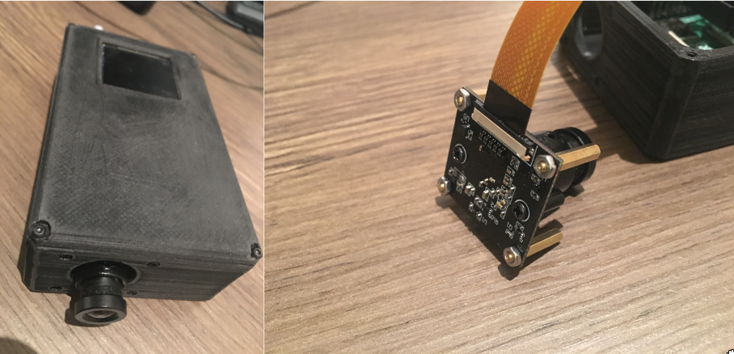
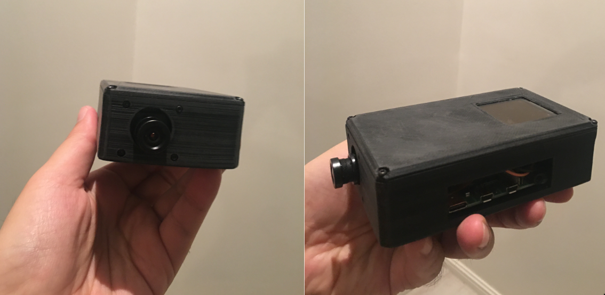

Introduction
============
Smart Night Vision (SNV) Kit for Rasberry Pi aims for providing easy-to-use and cost-effective a night vision module for Rasberry Pi 3 or 4 modules. It comes with a camera module (`Sony IMX327 Starvis <https://www.sony-semicon.co.jp/products/common/pdf/IMX327LQR_LQR1_Flyer02.pdf>`_ image sensor), a Rasbian compatible MIPI device driver, and abundant C++ and python based examples which will help you to get on working for your project rapidly.

.. seealso::
   Further technical information of the SNV kit can be found in the following datasheets:
   - :download:`IMX327 Datasheet <datasheets/framos-imx327.pdf>`